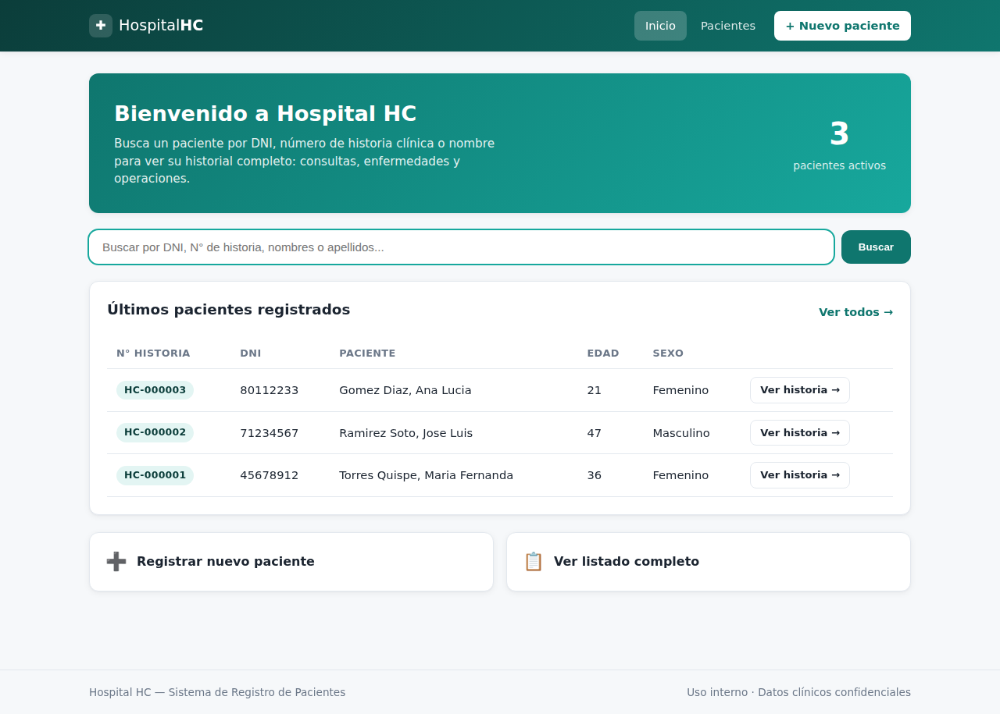
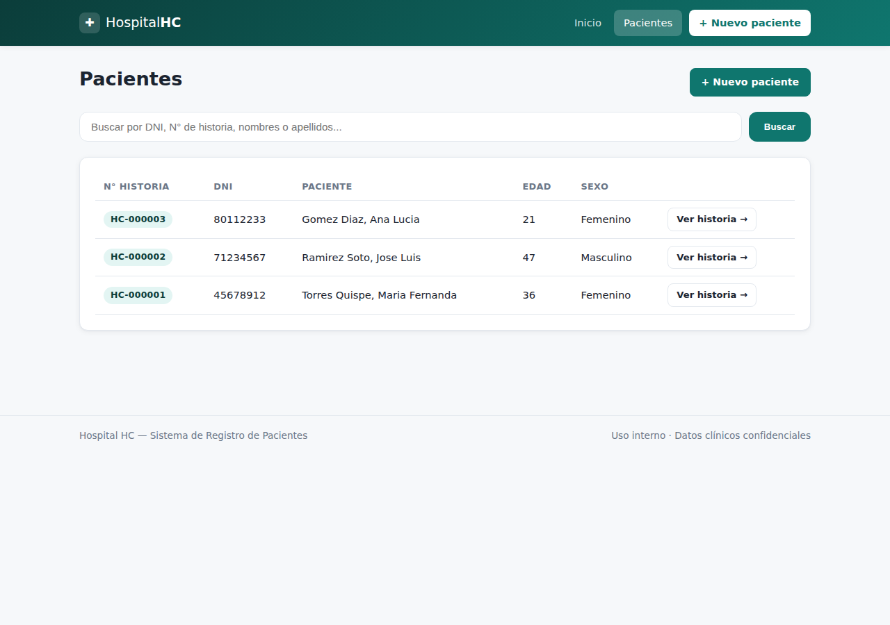
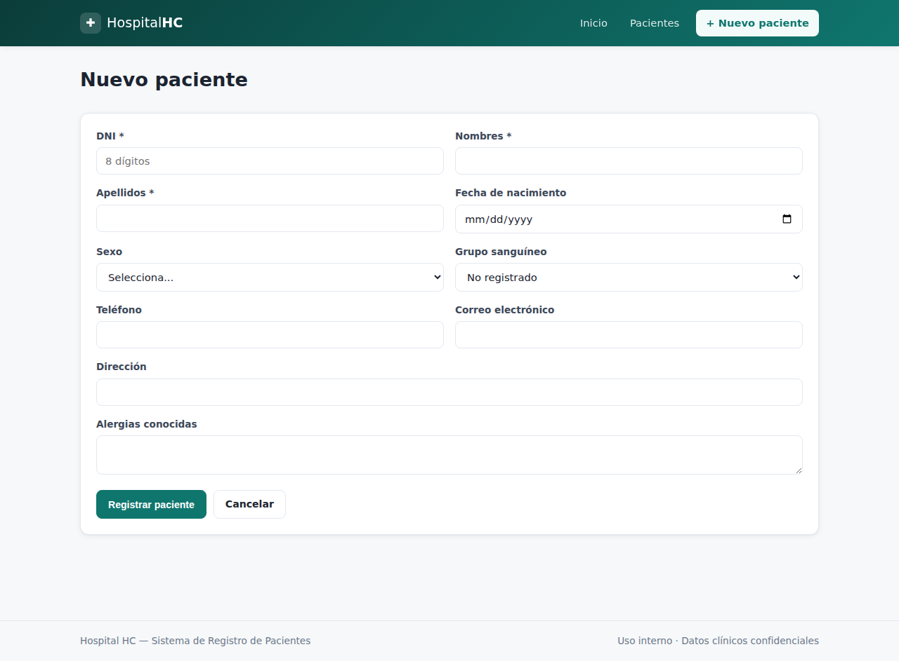
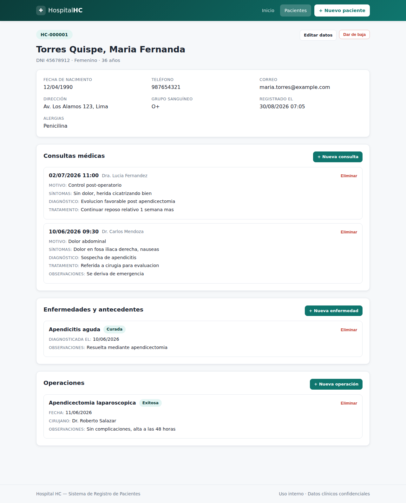

# Manual de usuario — Hospital HC

Este manual explica cómo usar el sistema desde el navegador, paso a paso.
Si todavía no arrancaste el servidor, revisa primero el `README.md` en la
raíz del proyecto.

## 1. Pantalla de inicio

Al entrar a `http://localhost:8080/` (o el puerto que hayas configurado)
verás la pantalla de inicio, con un contador de pacientes activos, un
buscador y la lista de los últimos pacientes registrados.

Desde aquí puedes:

- **Buscar un paciente** escribiendo su DNI, su número de historia clínica
  (por ejemplo `HC-000001`) o parte de su nombre o apellido, y presionando
  "Buscar".
- **Registrar un paciente nuevo** con el botón "+ Nuevo paciente".
- **Ver el listado completo** con el enlace "Ver todos →".

## 2. Listado de pacientes

En `Pacientes` (menú superior) puedes ver todos los pacientes activos, con
su número de historia clínica, DNI, nombre completo, edad y sexo. El mismo
buscador del inicio también está disponible aquí.

Haz clic en "Ver historia →" en la fila de cualquier paciente para abrir
su historia clínica completa.

## 3. Registrar un paciente nuevo

Desde "+ Nuevo paciente" se abre un formulario con los datos generales del
paciente.

Campos obligatorios (marcados con `*`): DNI, nombres y apellidos. El resto
son opcionales, pero se recomienda completarlos siempre que se pueda
(teléfono y correo son útiles para contactar al paciente; el grupo
sanguíneo y las alergias pueden ser decisivos en una urgencia).

El sistema valida automáticamente que:

- El **DNI** tenga exactamente 8 dígitos numéricos (formato peruano).
- No exista ya otro paciente registrado con el mismo DNI.
- La **fecha de nacimiento** no sea una fecha futura.
- El **sexo** y el **grupo sanguíneo**, si se indican, sean valores válidos
  de la lista.

Si algo no es válido, el formulario se vuelve a mostrar con un mensaje
explicando exactamente qué corregir, sin perder los datos que ya habías
escrito.

Al guardar, el sistema **genera automáticamente el número de historia
clínica** (por ejemplo `HC-000004`) — no hay que escribirlo a mano, y
nunca se repite.

## 4. Historia clínica de un paciente

Esta es la pantalla principal del sistema: muestra todos los datos y todo
el historial médico de un paciente en un solo lugar.

Incluye:

- **Datos generales**: fecha de nacimiento, teléfono, correo, dirección,
  grupo sanguíneo, alergias y fecha de registro.
- **Consultas médicas**: cada visita del paciente, con motivo, síntomas,
  diagnóstico, tratamiento indicado y observaciones, ordenadas de la más
  reciente a la más antigua.
- **Enfermedades y antecedentes**: enfermedades diagnosticadas, con su
  fecha y estado (Activa, Controlada o Curada).
- **Operaciones**: intervenciones quirúrgicas, con fecha, cirujano y
  resultado (Exitosa, Con complicaciones o Fallida).

Desde esta pantalla puedes:

- **Editar datos** del paciente (botón junto al nombre).
- **Dar de baja** al paciente (lo quita del listado de activos, pero
  conserva todo su historial — ver sección 6).
- **Agregar** una nueva consulta, enfermedad u operación con los botones
  "+ Nueva..." de cada sección.
- **Eliminar** un registro puntual (una consulta, enfermedad u operación)
  con el enlace "Eliminar" de esa tarjeta. Se pide confirmación antes de
  borrar.

### 4.1 Agregar una consulta médica

Motivo, síntomas y diagnóstico son obligatorios. Si no indicas fecha y
hora, el sistema usa el momento actual automáticamente.

### 4.2 Agregar una enfermedad o antecedente

El nombre de la enfermedad es obligatorio. El estado por defecto es
"Activa"; puedes cambiarlo a "Controlada" o "Curada" según corresponda.

### 4.3 Agregar una operación

El tipo de operación y la fecha son obligatorios. El resultado por
defecto es "Exitosa".

## 5. Buscar un paciente

El buscador (disponible en el inicio y en el listado de pacientes) admite:

- **DNI exacto**: `45678912`
- **Número de historia clínica exacto**: `HC-000001`
- **Nombre o apellido parcial**: `torres`, `maria`, `gomez diaz`

No distingue mayúsculas de minúsculas.

## 6. Dar de baja a un paciente (baja lógica)

El botón "Dar de baja" **no borra** al paciente ni su historial: solo lo
saca del listado de pacientes activos, para casos como un paciente que ya
no acude al centro. Toda su información — consultas, enfermedades,
operaciones — se conserva intacta y sigue siendo accesible si abres el
enlace directo a su historia clínica. Esto es intencional: en un sistema
de salud, el historial clínico no debe desaparecer.

## 7. Preguntas frecuentes

**¿Puedo usar el sistema desde otra computadora de la misma red?**
Sí. En vez de `http://localhost:8080/`, en la otra computadora usa la
dirección IP de la máquina donde corre el servidor, por ejemplo
`http://192.168.1.10:8080/`. Ten en cuenta que el sistema no tiene login
(ver limitaciones en el `README.md`), así que cualquiera con acceso a esa
IP y puerto puede ver y editar los datos.

**Cerré la terminal y el sistema dejó de funcionar, ¿perdí mis datos?**
No. Los datos se guardan en la carpeta `data/` en el disco, no en la
memoria del programa. Simplemente vuelve a ejecutar `java -jar
hospital.jar` y todo tu historial seguirá ahí.

**Registré mal un dato de un paciente, ¿cómo lo corrijo?**
Entra a la historia clínica del paciente y usa "Editar datos" para
corregir sus datos generales. Para una consulta, enfermedad u operación
puntual mal registrada, la opción más simple es eliminarla y volver a
registrarla correctamente.
